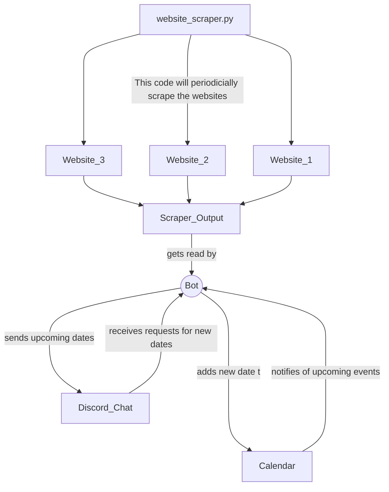

Romsev C.  
 

___
### Table of Contents
  
- [Description](#description)
  - [Goal](#goal)
  - [Why Google Calendar?](#why-google-calendar)
- [Code Interaction Ecosystem](#code-interaction-ecosystem)
- [How to contribute](#how-to-contribute)
  - [Troubleshooting](#troubleshooting)

___

This project was brought upon by the request of one of the ISUE Lab members, the message was:

>Hey @Undergrad Student, since we have a discord server. I wanted to propose a small project idea that would just be helpful in general for the lab. 
>Develop a Discord Bot to remind us of the deadlines for upcoming paper deadlines
>Conferences We Typically are interested in (Can be appended to in the future)
>  - ACM CHI (This would include CHI conference, CHI Late-breaking work, TOCHI, CHI-Play, etc.)
>  - IEEE VR
>  - CSCW
>  - Graphics Interface
>  - ISMAR
>  - VRST
> 
> Some Features that would be nice 
> 	 - Add conferences dynamically via a chat command 
>	 - Scrape the Conference's website when dates come out to find the abstract deadline and paper deadline 
>	 - A way for users in the server to subscribe to the notifications

### Description
#### Goal
To break it down the goal is to:

1. Make a discord bot that scrapes a certain website and automatically adds conference dates
    -  A python script can be used to scrape the website
    - Data from the scrape can be put into some sort of scrape output file
    - Discord bot will read from the scrape output file periodically and add conference dates based on that
2. Add conference dates using chat commands
    - Need to figure out a way for the backend to keep track of dates, what calendar are we gonna use etc.
    - Google calendar is a possible good interface
3. Way for anyone in the server to subscribe to notifications such as thru email, etc.  
#### Why Google Calendar?
I decided to use Google Calendar as a backend for the bot so we didn't have to completely build a calendar that can hold events and such from the ground up. Google is already feature rich and provides the ability to subscribe to the ResearchBuddy's personal Calendar and get email notifications if desired.  
The annoying part of using Google's API is having to manually log into the bot's account and authenticating the bot to use it's own calendar.
___
### Code Interaction Ecosystem


___

### How to contribute
aka which modules to import  

The ResearchBuddy bot uses its own personal Google account to work with a Calendar as a backend, so whoever is developing and testing should have a Google account with a Calendar that they don't mind the bot editing.

The modules the bot uses are:

[py-cord](https://pypi.org/project/py-cord/) is used as the API wrapper to talk to discord, [python-dotenv](https://pypi.org/project/python-dotenv/) for the env variables (given seperately)    
```
pip install py-cord
pip install python-dotenv
```

WebScrapper requires the modules  
[beautifulsoup4](https://www.crummy.com/software/BeautifulSoup/bs4/doc/#installing-beautiful-soup)  for parsing the of the requested websites  
```
pip install beautifulsoup4
```


Finally, the Calendar backend requires these modules  
[dateutil](https://pypi.org/project/python-dateutil/) and [pytz](https://pypi.org/project/pytz/) for date time formatting reasons  
and [google's python oauth client](https://developers.google.com/calendar/api/quickstart/python)
  
  ```
pip install pytz
pip install python-dateutil
pip install --upgrade google-api-python-client google-auth-httplib2 google-auth-oauthlib
  ```
#### Troubleshooting
If you run the bot and get a "bad auth request" (invalid_grant) just delete the generated "tokens.json" file and rerun the program
