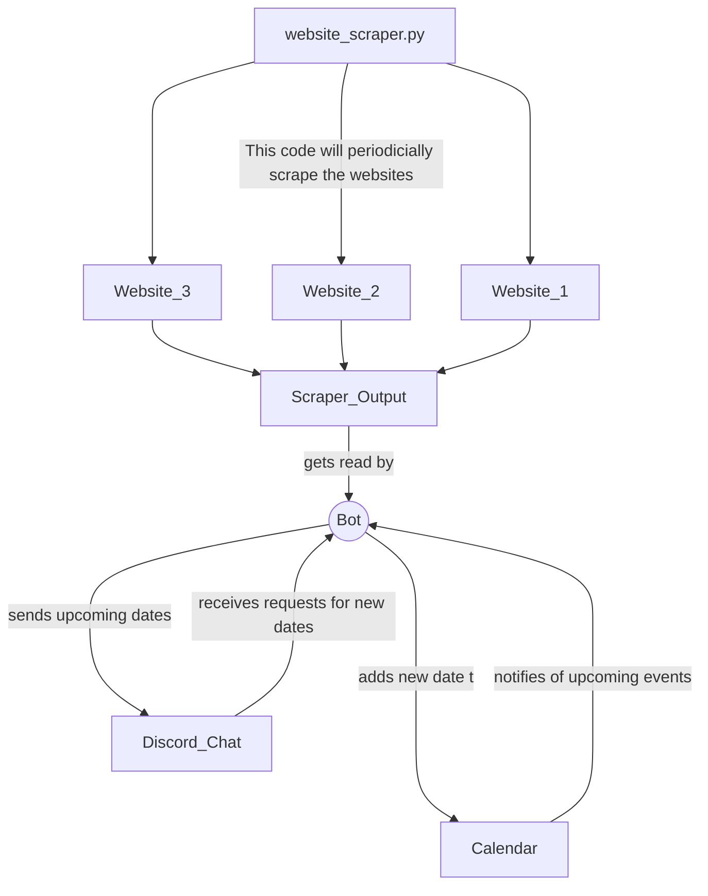

Austin Hyde  
Romsev Charles  
Faith Edwards  

This project was brought upon by the request of one of the ISUE Lab members, the message was:

>Hey @Undergrad Student, since we have a discord server. I wanted to propose a small project idea that would just be helpful in general for the lab. 
>Develop a Discord Bot to remind us of the deadlines for upcoming paper deadlines
>Conferences We Typically are interested in (Can be appended to in the future)
>  - ACM CHI (This would include CHI conference, CHI Late-breaking work, TOCHI, CHI-Play, etc.)
>  - IEEE VR
>  - CSCW
>  - Graphics Interface
>  - ISMAR
>  - VRST
>Some Features that would be nice 
> 	 - Add conferences dynamically via a chat command 
>	 - Scrape the Conference's website when dates come out to find the abstract deadline and paper deadline 
>	 - A way for users in the server to subscribe to the notifications

To break it down the goal is to:

1. Make a discord bot that scrapes a certain website and automatically adds conference dates
    -  A python script can be used to scrape the website
    - Data from the scrape can be put into some sort of scrape output file
    - Discord bot will read from the scrape output file periodically and add conference dates based on that
2. Add conference dates using chat commands
    - Need to figure out a way for the backend to keep track of dates, what calendar are we gonna use etc.
    - Google calendar is a possible good interface
3. Way for anyone in the server to subscribe to notifications such as thru email, etc.
___
### Code Interaction Ecosystem

